# 📊 SEQUENCE DIAGRAMS - SIPARKIR UNILA (General/Conceptual)

> Sequence diagram konseptual yang menggambarkan alur sistem tanpa detail implementasi teknis spesifik. Cocok untuk presentasi dan dokumentasi awal.

---

## 3.2.1 Sequence Diagram: Login


**Deskripsi Alur:**
1. User memasukkan kredensial login (username & password)
2. Sistem memvalidasi kredensial melalui modul autentikasi
3. Sistem mengecek data user di database
4. Sistem memverifikasi kecocokan password
5. Jika valid, sistem membuat session dan mengarahkan ke dashboard sesuai role
6. Jika tidak valid, sistem menampilkan pesan error

**Aktor:** Pengguna, Admin, Petugas Keamanan  
**Outcome:** User berhasil login dan mendapat akses sesuai hak aksesnya

---

## 3.2.2 Sequence Diagram: Registrasi Kendaraan


**Deskripsi Alur:**
1. Pengguna mengakses menu registrasi kendaraan
2. Sistem menampilkan form untuk input data kendaraan
3. Pengguna mengisi informasi kendaraan dan upload foto
4. Sistem memvalidasi kelengkapan dan format data
5. Jika valid, sistem menyimpan foto ke storage
6. Sistem menyimpan data kendaraan ke database dengan ID unik
7. Sistem menampilkan konfirmasi registrasi berhasil

**Aktor:** Pengguna (Mahasiswa/Dosen/Staff)  
**Outcome:** Kendaraan terdaftar dalam sistem dengan status "Tidak Parkir"

---

## 3.2.3 Sequence Diagram: Melakukan Parkir (Check-In)


**Deskripsi Alur:**
1. Pengguna memilih kendaraan yang akan diparkir
2. Sistem menampilkan form untuk input lokasi parkir
3. Pengguna memilih lokasi dan konfirmasi check-in
4. Sistem mengecek apakah kendaraan belum sedang parkir
5. Jika valid, sistem mencatat waktu masuk dan lokasi parkir
6. Sistem mengubah status kendaraan menjadi "Parkir"
7. Sistem mengirim notifikasi dan menampilkan bukti parkir

**Aktor:** Pengguna  
**Outcome:** Kendaraan tercatat masuk area parkir dengan timestamp

---

## 3.2.4 Sequence Diagram: Keluar Parkir (Check-Out)


**Deskripsi Alur:**
1. Pengguna memilih kendaraan untuk check-out
2. Sistem mengecek apakah kendaraan sedang parkir
3. Jika sedang parkir, sistem menghitung durasi (waktu keluar - waktu masuk)
4. Sistem mencatat waktu keluar dan durasi parkir
5. Sistem mengubah status kendaraan kembali menjadi "Tidak Parkir"
6. Sistem menampilkan ringkasan parkir dengan durasi

**Aktor:** Pengguna  
**Outcome:** Riwayat parkir lengkap dengan durasi tercatat

---

## 3.2.5 Sequence Diagram: Melakukan Lapor Kehilangan


**Deskripsi Alur:**
1. Pengguna mengakses menu laporan kehilangan
2. Sistem menampilkan form untuk detail kehilangan
3. Pengguna mengisi kronologi, lokasi, dan waktu kehilangan
4. Sistem memvalidasi kelengkapan informasi
5. Sistem menyimpan laporan dengan status "Pending"
6. Sistem mengubah status kendaraan menjadi "Hilang"
7. Sistem mengirim notifikasi ke petugas keamanan
8. Sistem memberikan nomor laporan kepada pengguna

**Aktor:** Pengguna  
**Outcome:** Laporan kehilangan tercatat dan petugas mendapat notifikasi

---

## 3.2.6 Sequence Diagram: Memonitoring Sistem Parkir


**Deskripsi Alur:**
1. Admin membuka dashboard monitoring sistem
2. Sistem mengambil data real-time dari database
3. Modul analytics menghitung statistik dan agregasi data
4. Sistem menampilkan dashboard dengan informasi:
   - Jumlah kendaraan parkir saat ini
   - Kapasitas parkir tersedia
   - Total pengguna terdaftar
   - Jumlah laporan pending
   - Grafik trend penggunaan
5. Dashboard auto-refresh setiap 30 detik untuk data terkini

**Aktor:** Admin  
**Outcome:** Admin mendapat visibility real-time kondisi sistem parkir

---

## 3.2.7 Sequence Diagram: Membuat Laporan Statistik


**Deskripsi Alur:**
1. Admin mengakses menu pembuatan laporan
2. Admin memilih parameter (periode waktu, jenis laporan)
3. Sistem mengumpulkan data dari database sesuai periode
4. Modul analytics menghitung berbagai statistik:
   - Total transaksi parkir
   - Rata-rata durasi parkir
   - Jam sibuk (peak hours)
   - Jumlah laporan kehilangan
   - Tingkat resolved
5. Sistem generate laporan dengan visualisasi (grafik, tabel)
6. Admin dapat preview dan download dalam format PDF
7. Sistem mencatat log pembuatan laporan

**Aktor:** Admin  
**Outcome:** Laporan statistik periode tertentu tersedia dalam format PDF

---

## 3.2.8 Sequence Diagram: Mengelola Database Kendaraan


**Deskripsi Alur:**
1. Petugas membuka menu kelola database kendaraan
2. Sistem menampilkan tabel semua kendaraan terdaftar
3. Petugas dapat melakukan:
   
   **Pencarian:**
   - Input keyword (plat nomor, nama pemilik, merk)
   - Sistem filter dan tampilkan hasil
   
   **Edit Data:**
   - Pilih kendaraan dan akses form edit
   - Update informasi (plat, jenis, status, dll)
   - Sistem validasi dan simpan perubahan
   
   **Hapus Data:**
   - Pilih kendaraan dan klik hapus
   - Konfirmasi penghapusan
   - Sistem hapus data dari database

**Aktor:** Petugas Keamanan  
**Outcome:** Database kendaraan terkelola dengan baik (CRUD operations)

---

## 3.2.9 Sequence Diagram: Mencatat Kendaraan Masuk/Keluar

```mermaid
sequenceDiagram
    actor Petugas as Petugas Keamanan
    participant Scanner as QR Scanner
    participant System as Sistem SIPARKIR
    participant Validation as Validation Module
    participant DB as Database
    participant Notification as Notification Module

    Note over Petugas,Notification: PROSES KENDARAAN MASUK
    
    activate Petugas
    Petugas->>+Scanner: Scan QR Code kendaraan
    Scanner->>+System: Kirim ID kendaraan
    System->>+Validation: Validasi kendaraan terdaftar
    
    alt Kendaraan valid dan belum parkir
        Validation-->>-System: Valid untuk masuk
        System->>+DB: Catat waktu masuk dan lokasi
        DB-->>-System: Data tersimpan
        System->>+DB: Update status kendaraan "Parkir"
        DB-->>-System: Status terupdate
        System->>+Notification: Kirim notifikasi ke pemilik
        Notification-->>-System: Notifikasi terkirim
        System-->>-Petugas: Tampilkan "Kendaraan masuk tercatat"<br/>dengan detail kendaraan
        deactivate Scanner
    else Kendaraan tidak valid
        Validation-->>-System: Kendaraan tidak terdaftar
        System-->>-Petugas: Tampilkan peringatan
        deactivate Scanner
    end
    
    Note over Petugas,Notification: [KENDARAAN PARKIR...]
    
    Note over Petugas,Notification: PROSES KENDARAAN KELUAR
    
    Petugas->>+Scanner: Scan QR Code kendaraan
    Scanner->>+System: Kirim ID kendaraan
    System->>+Validation: Validasi kendaraan sedang parkir
    
    alt Ada parkir aktif
        Validation-->>-System: Valid untuk keluar
        System->>System: Hitung durasi parkir
        activate System
        deactivate System
        System->>+DB: Catat waktu keluar dan durasi
        DB-->>-System: Data tersimpan
        System->>+DB: Update status kendaraan "Tidak Parkir"
        DB-->>-System: Status terupdate
        System->>+Notification: Kirim ringkasan ke pemilik
        Notification-->>-System: Notifikasi terkirim
        System-->>-Petugas: Tampilkan "Kendaraan keluar"<br/>Durasi: X jam Y menit
        deactivate Scanner
    else Tidak ada parkir aktif
        Validation-->>-System: Kendaraan tidak sedang parkir
        System-->>-Petugas: Tampilkan peringatan
        deactivate Scanner
    end
    deactivate Petugas
```

**Deskripsi Alur:**

**KENDARAAN MASUK:**
1. Petugas scan QR Code pada kendaraan
2. Sistem mendapat ID kendaraan dari QR
3. Sistem validasi apakah kendaraan terdaftar
4. Jika valid, sistem catat waktu masuk dan lokasi
5. Sistem update status kendaraan menjadi "Parkir"
6. Sistem kirim notifikasi ke pemilik kendaraan
7. Petugas melihat konfirmasi sukses

**KENDARAAN KELUAR:**
1. Petugas scan QR Code kendaraan yang keluar
2. Sistem cek apakah kendaraan sedang parkir
3. Sistem hitung durasi parkir (keluar - masuk)
4. Sistem catat waktu keluar dan durasi
5. Sistem update status kendaraan menjadi "Tidak Parkir"
6. Sistem kirim ringkasan parkir ke pemilik
7. Petugas melihat durasi parkir

**Aktor:** Petugas Keamanan  
**Outcome:** Setiap kendaraan masuk/keluar tercatat dengan akurat dan real-time

---

## 3.2.10 Sequence Diagram: Memverifikasi Identitas Kendaraan

```mermaid
sequenceDiagram
    actor Petugas as Petugas Keamanan
    participant System as Sistem SIPARKIR
    participant Search as Search Module
    participant DB as Database
    participant Display as Display Module
    participant Log as Logging Module

    activate Petugas
    Petugas->>+System: Input plat nomor kendaraan
    System->>+Search: Cari data kendaraan
    Search->>+DB: Query kendaraan by plat nomor
    DB-->>-Search: Data kendaraan + pemilik + foto
    Search-->>-System: Data lengkap kendaraan
    System->>+Display: Tampilkan data untuk verifikasi
    Display-->>-Petugas: Tampilkan:<br/>- Foto kendaraan<br/>- Plat nomor<br/>- Jenis, merk, warna<br/>- Data pemilik (nama, NIM)<br/>- Status parkir
    
    Petugas->>Petugas: Cocokkan fisik kendaraan dengan:<br/>- Foto di sistem<br/>- Data plat nomor<br/>- Warna dan merk<br/>- KTM/identitas pemilik
    activate Petugas
    deactivate Petugas
    
    alt Verifikasi berhasil (data cocok)
        Petugas->>System: Konfirmasi "Identitas Valid"
        System->>+Log: Catat log verifikasi
        Log->>+DB: Simpan log (petugas, waktu, hasil)
        DB-->>-Log: Log tersimpan
        Log-->>-System: Log selesai
        System-->>-Petugas: Tampilkan "Identitas Valid ✓"<br/>Lanjutkan proses
    else Verifikasi gagal (data tidak cocok)
        Petugas->>System: Konfirmasi "Identitas Tidak Valid"
        System->>+Log: Catat log verifikasi gagal
        Log->>+DB: Simpan log dengan catatan
        DB-->>-Log: Log tersimpan
        Log-->>-System: Log selesai
        System-->>-Petugas: Tampilkan "Identitas Tidak Valid ✗"<br/>Tolak akses
    end
    deactivate Petugas
```

**Deskripsi Alur:**
1. Petugas input/scan plat nomor kendaraan
2. Sistem mencari data kendaraan di database
3. Sistem menampilkan informasi lengkap:
   - Foto kendaraan yang terdaftar
   - Plat nomor, jenis, merk, warna
   - Data pemilik (nama, NIM/NIP)
   - Status parkir saat ini
4. Petugas melakukan verifikasi manual dengan mencocokkan:
   - Kendaraan fisik dengan foto di sistem
   - Plat nomor fisik dengan data
   - Warna dan merk kendaraan
   - KTM/SIM pemilik dengan data
5. Petugas memberi konfirmasi valid atau tidak valid
6. Sistem mencatat log verifikasi
7. Jika valid, proses dilanjutkan; jika tidak, akses ditolak

**Aktor:** Petugas Keamanan  
**Outcome:** Identitas kendaraan terverifikasi untuk mencegah penyalahgunaan

---

## 3.2.11 Sequence Diagram: Menangani Laporan Kehilangan

```mermaid
sequenceDiagram
    actor Petugas as Petugas Keamanan
    participant System as Sistem SIPARKIR
    participant Search as Search Module
    participant DB as Database
    participant Display as Display Module
    participant Log as Logging Module

    Petugas->>System: Input plat nomor kendaraan
    
    System->>+Search: Cari data kendaraan
    Search->>+DB: Query kendaraan by plat nomor
    DB-->>-Search: Data kendaraan + pemilik + foto
    Search-->>-System: Data lengkap kendaraan

    System->>+Display: Tampilkan data kendaraan
    Display-->>-Petugas: Menampilkan:<br/>• Foto kendaraan<br/>• Plat nomor<br/>• Merk, jenis, warna<br/>• Data pemilik<br/>• Status parkir

    Petugas->>Petugas: Cocokkan data dengan fisik kendaraan

    alt Verifikasi berhasil
        Petugas->>System: Konfirmasi "Identitas Valid"
        System->>+Log: Catat log valid
        Log->>+DB: Simpan log verifikasi
        DB-->>-Log: Log tersimpan
        Log-->>-System: Log selesai
        System-->>Petugas: Tampilkan "Identitas Valid ✓"
    else Verifikasi gagal
        Petugas->>System: Konfirmasi "Identitas Tidak Valid"
        System->>+Log: Catat log gagal
        Log->>+DB: Simpan log verifikasi gagal
        DB-->>-Log: Log tersimpan
        Log-->>-System: Log selesai
        System-->>Petugas: Tampilkan "Identitas Tidak Valid ✗"
    end
```



**Deskripsi Alur:**
1. Petugas membuka daftar laporan kehilangan
2. Sistem menampilkan laporan dengan status "Pending"
3. Petugas memilih laporan untuk ditangani
4. Sistem menampilkan detail lengkap laporan:
   - Informasi kendaraan yang hilang
   - Kronologi kejadian
   - Lokasi dan waktu kehilangan
   - Data pelapor
5. Petugas melakukan investigasi:
   - Review rekaman CCTV
   - Koordinasi dengan satpam kampus
   - Pencarian di area parkir
6. Petugas input hasil investigasi ke sistem
7. Sistem update status menjadi "In Progress"
8. Sistem kirim notifikasi progress ke pelapor
9. Jika kendaraan ditemukan:
   - Update status laporan menjadi "Resolved"
   - Update status kendaraan kembali normal
   - Kirim notifikasi ke pemilik
10. Jika tidak ditemukan:
    - Catat hasil akhir investigasi
    - Update pelapor dengan status akhir

**Aktor:** Petugas Keamanan, Pengguna (sebagai pelapor)  
**Outcome:** Laporan kehilangan tertangani dengan investigasi yang terdokumentasi

---

## 📋 RINGKASAN INTERAKSI SISTEM

### **Pengguna (Mahasiswa/Dosen/Staff)**
| No | Use Case | Interaksi |
|----|----------|-----------|
| 1 | Login | Input kredensial → Validasi → Dashboard |
| 2 | Registrasi Kendaraan | Input data → Upload foto → Tersimpan |
| 3 | Parkir Masuk | Pilih kendaraan → Pilih lokasi → Check-in |
| 4 | Parkir Keluar | Pilih kendaraan → Check-out → Lihat durasi |
| 5 | Lapor Kehilangan | Isi kronologi → Submit → Dapat nomor laporan |

### **Admin**
| No | Use Case | Interaksi |
|----|----------|-----------|
| 1 | Login | Input kredensial → Validasi → Dashboard Admin |
| 2 | Monitoring Sistem | Lihat dashboard → Auto-refresh real-time |
| 3 | Laporan Statistik | Pilih periode → Generate → Download PDF |

### **Petugas Keamanan**
| No | Use Case | Interaksi |
|----|----------|-----------|
| 1 | Login | Input kredensial → Validasi → Dashboard Petugas |
| 2 | Kelola Database | CRUD kendaraan → Search → Update |
| 3 | Catat Masuk/Keluar | Scan QR → Validasi → Catat timestamp |
| 4 | Verifikasi Identitas | Input plat → Lihat data → Konfirmasi valid |
| 5 | Tangani Laporan | Lihat laporan → Investigasi → Update status |

---

## 🎯 VALIDASI USE CASE

| No | Use Case | Sequence Diagram | Status | Kompleksitas |
|----|----------|------------------|--------|--------------|
| 3.2.1 | Login | ✅ Complete | Match | ⭐⭐ |
| 3.2.2 | Registrasi Kendaraan | ✅ Complete | Match | ⭐⭐⭐ |
| 3.2.3 | Melakukan Parkir | ✅ Complete | Match | ⭐⭐⭐ |
| 3.2.4 | Keluar Parkir | ✅ Complete | Match | ⭐⭐⭐ |
| 3.2.5 | Lapor Kehilangan | ✅ Complete | Match | ⭐⭐⭐ |
| 3.2.6 | Monitoring Sistem | ✅ Complete | Match | ⭐⭐⭐⭐ |
| 3.2.7 | Laporan Statistik | ✅ Complete | Match | ⭐⭐⭐⭐ |
| 3.2.8 | Kelola Database | ✅ Complete | Match | ⭐⭐⭐ |
| 3.2.9 | Catat Masuk/Keluar | ✅ Complete | Match | ⭐⭐⭐⭐ |
| 3.2.10 | Verifikasi Identitas | ✅ Complete | Match | ⭐⭐⭐ |
| 3.2.11 | Tangani Laporan | ✅ Complete | Match | ⭐⭐⭐⭐⭐ |

**Keterangan Kompleksitas:**
- ⭐⭐ = Simple (CRUD basic)
- ⭐⭐⭐ = Medium (dengan validasi)
- ⭐⭐⭐⭐ = Complex (multiple modules)
- ⭐⭐⭐⭐⭐ = Very Complex (workflow management)

---

## 🔄 KOMPONEN SISTEM GENERAL


---

## 📊 ALUR DATA GENERAL


---

## ✅ KARAKTERISTIK SEQUENCE DIAGRAM INI

**Konseptual & General:**
- ❌ Tidak menyebutkan teknologi spesifik (PHP, MySQL, dll)
- ❌ Tidak ada nama file/endpoint spesifik
- ✅ Fokus pada alur logika bisnis
- ✅ Mudah dipahami non-technical stakeholder
- ✅ Cocok untuk presentasi/dokumentasi awal
- ✅ Technology-agnostic (bisa diimplementasi dengan stack apapun)

**Module-Based:**
- Authentication Module (untuk login)
- Validation Module (untuk validasi input)
- Analytics Module (untuk statistik)
- Notification Module (untuk notifikasi)
- Report Generator (untuk laporan)
- Search Module (untuk pencarian)
- Calculation Module (untuk perhitungan)
- Investigation Module (untuk investigasi)
- Logging Module (untuk audit trail)

**Database Generic:**
- Tidak menyebut tabel spesifik
- Hanya menyebut "Database" sebagai data storage
- Fokus pada operasi (Insert, Update, Select, Delete)

---

## 🎓 KEGUNAAN

**Untuk Presentasi:**
- Lebih mudah dijelaskan ke dosen/penguji
- Tidak terlalu teknis
- Fokus pada business process

**Untuk Dokumentasi:**
- Requirement specification
- System design document
- User manual

**Untuk Development:**
- Blueprint untuk implementasi
- Bisa diimplementasi dengan berbagai teknologi
- Panduan untuk tim developer

---

**📌 CATATAN:**
Sequence diagram ini bersifat **konseptual dan general**, cocok untuk:
- Dokumentasi awal proyek
- Presentasi kepada stakeholder non-teknis
- Panduan implementasi yang technology-agnostic
- Requirement specification

Untuk implementasi teknis detail, gunakan `SEQUENCE_DIAGRAMS.md` atau `SEQUENCE_DIAGRAMS_MERMAID.md`

---

**Dibuat:** December 1, 2025  
**Sistem:** SIPARKIR UNILA  
**Format:** Conceptual Sequence Diagrams (Mermaid)  
**Audience:** Stakeholder, Management, Documentation